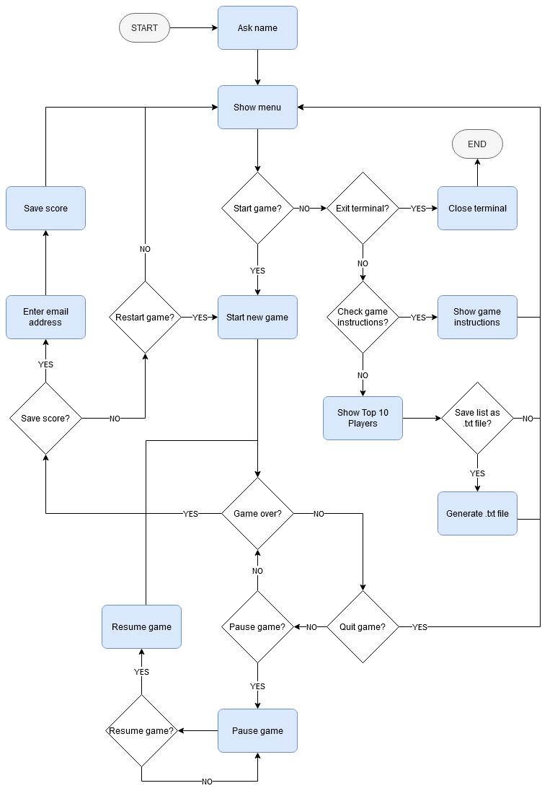
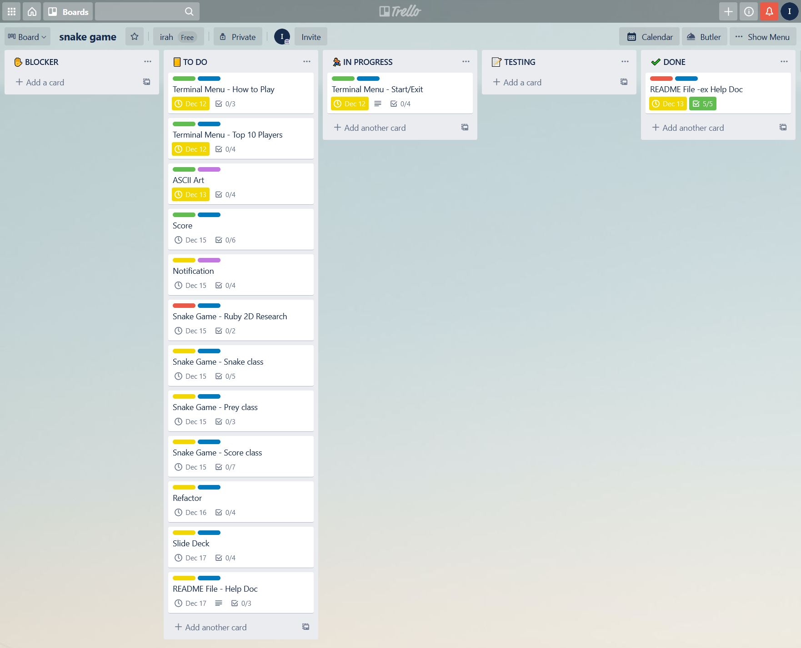

# Snake Game

## Purpose and Scope

Snake is a game that surged to popularity in the late 90s and early 2000s when Nokia phones came preloaded with it. It is a classic game where a player starts with a short line that moves forward and is maneuvered within a bordered plane in order to eat items in the form of dots. The line keeps moving forward and grows in length according to the number of items eaten, resembling a snake. The aim of the game is to eat as much items without hitting the snake's own body, or in some versions, the borders.

This project aims to recreate the Snake game using Ruby. The project will apply object-oriented programming with the use of classes, defining methods and utilising algorithm knowledge that I've gained so far. In the process of developing the game, I also aim to learn more about grids and coordinates and collision detection, which are essential concepts to the game. In addition, I will also be learning about how to apply Ruby gems to make the game more interactive and use-friendly, as well as tapping into the power of APIs (Application Programming Interfaces). This will hopefully extend my Ruby knowledge and solidy my skills in programming.

The aim of the program is to entertain as well as provide some competitive incentive. There will be a scoring system. The score is updated and printed out as the game is played and a final score is printed out once the game is over. The program will have the ability to keep track of players that have played the game, and maintain a leaderboard. It will also have a notification system that can alert the top player in real-time once their score has been beaten.

The target audience is anyone from someone looking to have a break from a day's work, to someone who is looking to improve their basic coordination skills, to a master Snake gamer wanting to keep their lead recorded.

## Features
#### Game interface
The actual game will be housed in a window separate to the terminal to give a better user experience. There will be an ability to pause and quit the game once it is started, and to restart the game once over. The snake will be able to go through the canvas borders and come back in through the other side. The game will automatically finish once the snake hits its own body.
#### Scoring system
The game will keep track of the number of items that the snake eats: 1 point for every dot. The program will keep a record of the top 10 highest scoring players and their corresponding scores.
#### User Input
Player name will be asked at the start of the game. The player's name will show in the interface while the game is being played. The game will not start unless a name is provided. At the end of the game, the player has the option to input their email address if they wish to be included in the leader board. Players' scores will only be saved and included to the leader board if they provide an email address.
#### Menu
There will be a list of menu items to assist the player before a new game is played:
   - The **Start** function will start the game.
   - The **How to Play** function will give a description of the game and show the controls available to play the game as well as controls to pause, restart and halt the game.
   - The **Top 10** function will retrieve a list of players currently in the top 10 and their corresponding top scores. This list will be printed out in the terminal but can also be printed out in a text file.
   - The **Exit** function will close the application.
#### Notification
The program will send an email notification to the current leader once a registered player beats their score. The notification will include the player name, the new top score, and the date when the new top score was recorded as well as an invitation to play the game again. No notification will be sent if the current top score remains the same. This notification assumes that a player who registers has given a valid email address.

## User Interface
The application will start in the terminal and take the user's name. Then the user is presented with the menu. The up and down arrow keys are used to choose from the four menu options: Start, How to Play, Top 10, and Exit. Limiting input to these four options will eliminate input error.

When selected, information on how to play the game is printed out to the terminal. In the same way, when Top 10 option is selected, the Top 10 players and their scores are printed out to the terminal with an option to save the list as a text file.

The game starts in a new window and once a game is over, the user can choose to keep restarting the game from this window. When the user exits the game, they will be sent back to the terminal with their highest score printed out. The user is asked if they want to play again or save their score or exit the program. Saving their score will require the player to submit their email address. This will then rank them and add them to the leader board.

When a user beats the current top score, an email notification is automatically sent to the holder of that top score to let them know that their score has been beaten along with the information of who beat them and an invitation to play the game again.

## Control Flow

## Implementation Plan
Trello was used to implement the features of this application. 
[Snake Game - Trello Board](https://trello.com/b/COkQo7qV)

## Setup
#### Installation
Install Ruby
#### Dependencies
This application uses the following gems:
- ruby2D
- TTY::Prompt
- net-smtp
- artii

#### System Requirements

Design help documentation which includes a set of instructions which accurately describe how to use and install the application.

You must include:
- steps to install the application
- any dependencies required by the application to operate
- any system/hardware requirements