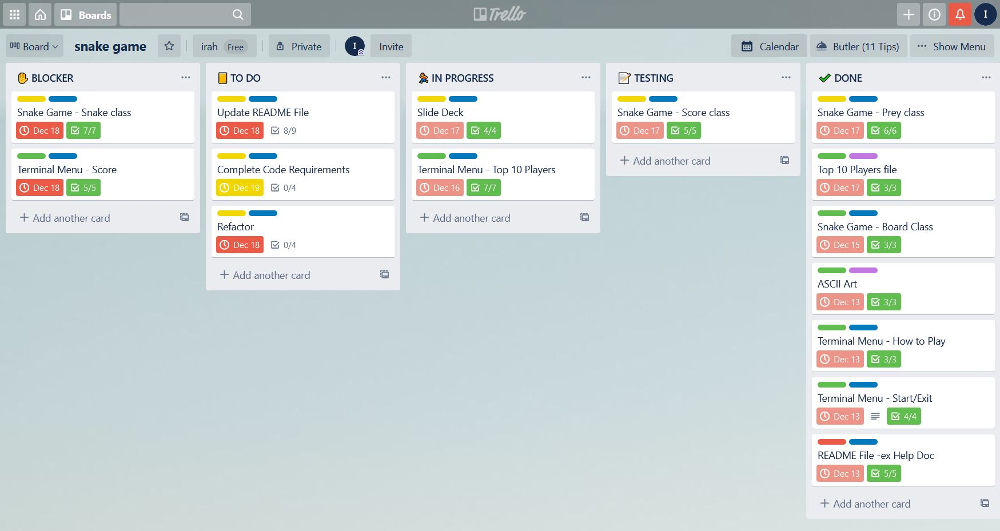

# Snake Game

Github Repo: [Snake Game](https://github.com/irahrosete/snake-game)

## Purpose and Scope

Snake Game surged to popularity in the late 90s and early 2000s when Nokia phones came preloaded with it. It is a classic game where a player starts with a short line that moves forward and is maneuvered within a bordered plane in order to eat items around the plane. The line keeps moving forward and grows in length according to the number of items eaten, resembling a snake. The aim of the game is to eat as much items without hitting the snake's own body or the borders.

This project aims to recreate the Snake Game using Ruby. The project will apply object-oriented programming with the use of classes, defining methods and utilising algorithm knowledge that I've gained so far. In the process of developing the game, I also aim to learn more about grids and coordinates and collision detection, which are essential concepts to the game. In addition, I will also be learning about how to apply Ruby gems to make the game more interactive and user-friendly. This will hopefully extend my Ruby knowledge and solidify my skills in programming.

The aim of the program is to entertain as well as provide some competitive incentive. There will be a scoring system. The score is updated and printed out as the game is played and a final score is printed out once the game is over. The program will have the ability to keep track of players that have played the game, and maintain a leaderboard. This data will persist and will be saved in a database in the form of a yaml file.

The target audience is anyone from someone looking to have a break from a day's work, to someone who is looking to improve their basic coordination skills, to a master Snake gamer wanting to keep their lead recorded.

## Features

#### User Input
The user is greeted in the welcome screen, and a player name is asked. The application will not progress unless a name is provided. Error is handled here in that when the user hits enter but does not input a name, the application will ask for a name again. The player's name will show in the game interface whilst the game is being played.
#### Menu
After the welcome screen, the user is presented with a list of menu items to assist before a new game is played:
   - The **Start Game** option will start the game.
   - The **How to Play** option will give a description of the game and show the controls available to play the game.
   - The **Top 10 Players** option will retrieve a list of players currently in the top 10 and their corresponding top scores. This list will be printed out in the terminal screen but can also be printed out as a text file.
   - The **Exit** option will close the application.

Limiting input to these four options will eliminate user input error.

Both the **How to Play** and **Top 10 Players** options will send the user back to the main menu. Once the game is finished, the user is sent back to the welcome screen.
#### Game interface
The game is played on a 16x16 grid. It starts with the snake having a length of three grids and moving forward to the right. The food is randomly generated within the grid. There is no ability to pause or quit the game once it is started. The game will automatically finish once the snake hits its own body or any of the borders.
#### Scoring system
The game will keep track of the number of items that the snake eats: 1 point for every item. The program will keep a record of player names and their corresponding scores in a persistent database in the form of a yaml file. New player name and score get added when user chooses to save their score at the end of each game.
#### File Output
There is an ability to save the list of Top 10 Players into a .txt file.

## User Interface
The application will start in the terminal and take the user's name. Then the user is presented with the menu. The up and down arrow keys are used to choose from the four menu options: Start, How to Play, Top 10 Players, and Exit.

When selected, information on how to play the game is printed out to the terminal.

In the same way, when Top 10 Players option is selected, the Top 10 players and their scores are printed out to the terminal with an option to save the list as a text file.

The game starts with a fresh screen and once the game is over, the final score gets printed out. The user can then choose to save their score. If they choose to save, the score will get appended to a database. This will then be available to recalculate the new top 10 players once the user checks the Top 10 Players menu again.

## Control Flow

## Implementation Plan
Trello was used to implement the features of this application. The game was initially planned to utilise the Ruby2D gem but there were compatibility issues with using it in Ubuntu WSL. A decision was made to render the game raw on the terminal.

[Snake Game - Trello Board](https://trello.com/b/COkQo7qV)

## Setup
#### Dependencies
As this application runs on Ruby, you will need to have Ruby installed on your system. If you do not have Ruby installed, use this [guide](https://www.ruby-lang.org/en/documentation/installation/).

This application uses the following gems:
1. TTY Prompt
2. TTY Table
3. Pastel

All of the gems have been bundled with the applcation. If you do not have bundler installed, run `gem install bundler` in your terminal.

#### Installation
Clone github repo
Navigate to src folder
run `bundle install` to use the gems above.
run script *include bundle install in script

#### System Requirements
Ruby version 2.7.1 was used to develop this application on Windows 10.

This application was designed and tested to render on Ubuntu WSL 18.04. Graphics may therefore render differently when using other systems.

## Resources
[How to Use Ruby Threads: An Easy To Understand Tutorial](https://www.rubyguides.com/2015/07/ruby-threads/) 
[Ruby 2D](https://www.ruby2d.com/learn/) 
[Saving/Retrieving Data With a YAML file in Ruby: The Basics](https://medium.com/@kristenfletcherwilde/saving-retrieving-data-with-a-yaml-file-in-ruby-the-basics-e45232903d94) 
[Understanding Screen and Internal Coordinates](https://subscription.packtpub.com/book/game_development/9781786466198/1/ch01lvl1sec16/understanding-screen-and-internal-coordinates)